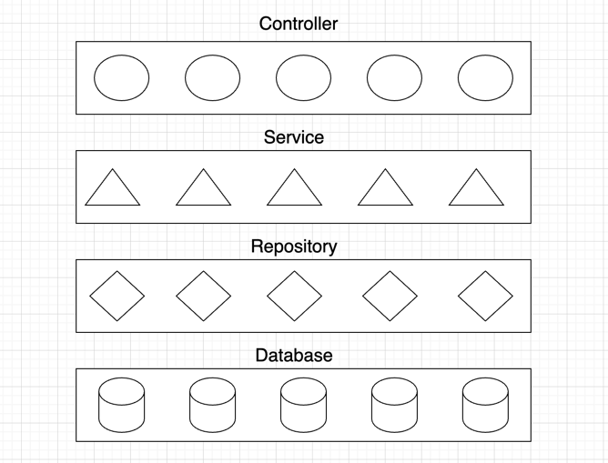
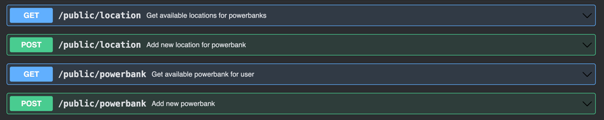
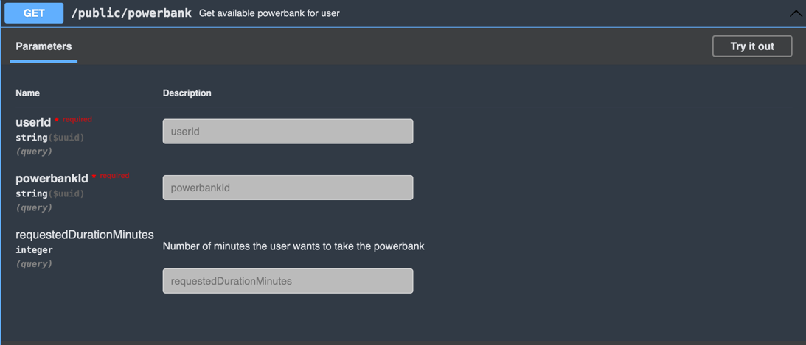
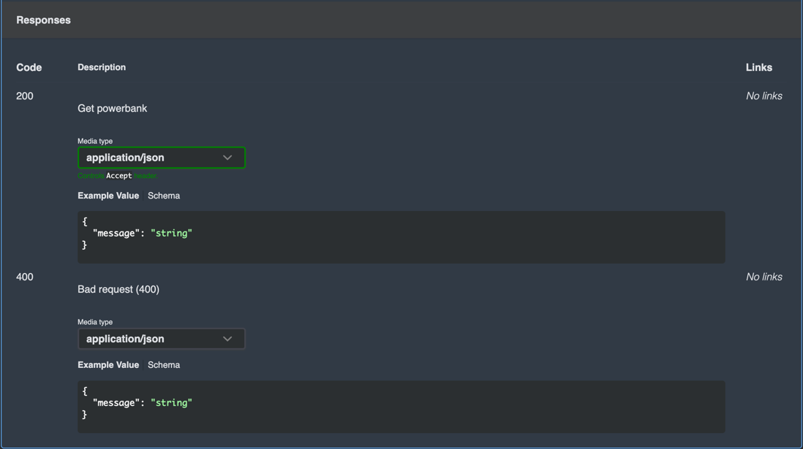

# PowerFind

PowerFind is a demo backend project
(not a real product) created to demonstrate my Java developer skills.
It simulates powerbank charging backend system.

## About project

I use a layered Spring Boot architecture including controller, service, repository, and model layers connected to a
PostgresSQL database, as illustrated in the image. Spring Boot simplifies my development by managing configurations,
dependencies, and providing built-in support for RESTful APIs and data persistence.



## Controller

The controller layer handles HTTP requests and routes them to the appropriate service calls.
Using OpenAPI, I generate interfaces with predefined routes, then implement them in the controllers to provide logic.
The controllers receive parameters via generated external models, transform them into domain objects, and pass them to
the service layer for processing.

## Service

The service layer contains the core business logic.
It processes data and connects the controller with the repository.

## Repository

The repository layer handles all database access.
It communicates directly with PostgresSQL to store and retrieve data.

## Database

I use a PostgresSQL database to persist all system data, integrated with Spring Boot via JDBC.
For migrations, I use Liquibase and have written an additional .sql-formatted migration to insert example data into the
database.

## OpenAPI

This project includes an OpenAPI specification that defines the available API endpoints.
It covers which endpoints are available,what inputs they require, and what responses they return.

The OpenAPI spec makes the API well-documented, easy to integrate, and simple to maintain.

Here’s a visual overview of the available endpoints:



For example, here’s a more detailed view of the `/public/powerbank` GET endpoint:




## Test

This project contains integration tests located in:

`src/test/java/com/powerFind/`

In these tests:

1) Used @SpringBootTest to load the full Spring application context.

2) Test data directly using JdbcTemplate before each test (@BeforeEach).

3) Clear all database tables before each test to ensure isolated and consistent test conditions.

Perform assertions against the real database and service layer, verifying both data insertion and query results.
These integration tests ensure that the interaction between the service layer, repositories, and database works as
expected under real conditions.

## Gateway

In this project, I have implemented **Spring Cloud Gateway** as the central API routing layer.

All external routes start with the prefix: `/api/v1`

The gateway rewrites and forwards these requests to the backend under: `/public/`

- `GET /api/v1/location` → backend `GET /public/location`
- `POST /api/v1/powerbank` → backend `POST /public/powerbank`

You can see the full route and filter configuration here:
[**application.yml**](https://github.com/Harut20024/PowerGateway/blob/main/src/main/resources/application.yml)

## CI/CD

This repository includes a CI/CD pipeline that automatically builds and pushes the Docker image of the PowerFind
application. It is set up using GitHub Actions, which builds the project using Gradle, starts PostgreSQL with Docker
Compose, and pushes the Docker image to Docker Hub. Whenever changes are pushed to the main branch, the pipeline ensures
that the latest version of the image is built and deployed. You can find the CI/CD configuration file in the
`.github/workflows` directory under the name ci.yml.

## Local run

To run the application locally, you can choose one of the following methods. Ensure you have Docker and JDK 21
installed.

1) Run Spring Boot App and Local PostgreSQL Docker:

   Start your Spring Boot application and PostgreSQL container locally.

2) Use Docker Compose (Java + PostgreSQL)

   Run both Java and PostgreSQL together using Docker Compose.

3) Manually Run Docker Containers:

   Pull the image from Docker Hub:

```bash
docker pull harut20024/powerfind:latest
```

Run PostgreSQL container:

```bash
docker run --name power-postgres \
-e POSTGRES_USER=user \
-e POSTGRES_PASSWORD=pass \
-e POSTGRES_DB=powerDB \
-p 5432:5432 \
-d postgres:14
```

Run PowerFind application container:

```bash
docker run --name powerfind_app \
--link power-postgres:postgres \
-e SPRING_DATASOURCE_URL=jdbc:postgresql://postgres:5432/powerDB \
-e SPRING_DATASOURCE_USERNAME=user \
-e SPRING_DATASOURCE_PASSWORD=pass \
-p 8080:8080 \
-d harut20024/powerfind:latest
```

