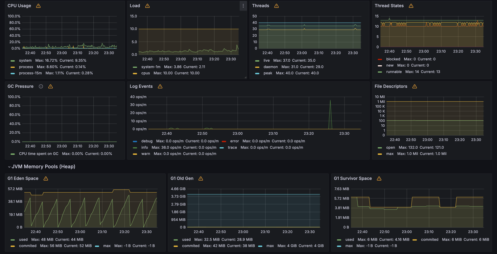

# PowerFind

PowerFind is a demo backend project
(not a real product) created to demonstrate my Java developer skills.
It simulates powerbank charging backend system.

## About project

I use a layered Spring Boot architecture including controller, service, repository, and model layers connected to a
PostgresSQL database, as illustrated in the image. Spring Boot simplifies my development by managing configurations,
dependencies, and providing built-in support for RESTful APIs and data persistence.

### Controller

The controller layer handles HTTP requests and routes them to the appropriate service calls.
Using OpenAPI, I generate interfaces with predefined routes, then implement them in the controllers to provide logic.
The controllers receive parameters via generated external models, transform them into domain objects, and pass them to
the service layer for processing.

### Service

The service layer contains the core business logic.
It processes data and connects the controller with the repository.

### Repository

The repository layer handles all database access.
It communicates directly with PostgresSQL to store and retrieve data.

### Database

I use a PostgresSQL database to persist all system data, integrated with Spring Boot via JDBC.
For migrations, I use Liquibase and have written an additional .sql-formatted migration to insert example data into the
database.

## OpenAPI

This project includes an OpenAPI specification that defines the available API endpoints.
It covers which endpoints are available,what inputs they require, and what responses they return.

The OpenAPI spec makes the API well-documented, easy to integrate, and simple to maintain.

Here’s a visual overview of the available endpoints:

For example, here’s a more detailed view of the `/public/powerbank` GET endpoint:

## Gateway

In this project, I have implemented **Spring Cloud Gateway** as the central API routing layer.

All external routes start with the prefix: `/api/v1`

The gateway rewrites and forwards these requests to the backend under: `/public/`

- `GET /api/v1/location` → backend `GET /public/location`
- `POST /api/v1/powerbank` → backend `POST /public/powerbank`

You can see the full route and filter configuration here:
[**application.yml**](https://github.com/Harut20024/PowerGateway/blob/main/src/main/resources/application.yml)

## Kafka

Kafka is used to send and receive messages between different parts of an application. It allows services to communicate
by producing and consuming messages through a messaging system.

Producer
A producer is responsible for creating and sending messages to a Kafka topic.
In this project, when a new power bank is saved, the application sends a message
containing details such as the power bank ID and model to the powerbank-events topic.

Consumer
A consumer reads messages from a Kafka topic.
In this project, the consumer listens to the `powerbank-topic` topic. When a message arrives, the consumer receives it
and can perform actions.

here is logs of Producer and Consumer`

## Monitoring

In this project, I use **Prometheus** and **Grafana** to monitor our Spring Boot application.

What they do

- **Prometheus** collects metrics from the app every few seconds (like CPU usage, request count, etc.).
- **Grafana** shows these metrics in charts and dashboards.

Together, they help us see how the app is performing in real-time.

How it works

1. **Spring Boot** exposes metrics at: `http://localhost:8080/actuator/prometheus`
2. **Prometheus** runs in Docker and pulls metrics from that endpoint every 15 seconds.  
   File: `monitoring/prometheus.yml`
3. **Grafana** also runs in Docker and reads data from Prometheus.  
   It loads dashboards from JSON files in `monitoring/grafana/dashboards/`

How to See the Results

1. Run docker-compose

Prometheus (metrics storage & queries): http://localhost:9090

Grafana (visual dashboards,Login: admin,Pass: admin): http://localhost:3000

### Loki Logging

In addition to metrics monitoring, this project uses **Loki** and **Promtail** for log aggregation and viewing in
Grafana.
How it works

1) The Spring Boot application writes logs to a file, e.g. logs/powerfind.log

2) Promtail is configured to watch this log file and send logs to Loki

3) Loki runs in Docker and stores logs

4) Grafana has Loki as a data source and can display logs in the Explore tab

## CI/CD

This repository includes a CI/CD pipeline that automatically builds and pushes the Docker image of the PowerFind
application. It is set up using GitHub Actions, which builds the project using Gradle, starts PostgreSQL with Docker
Compose, and pushes the Docker image to Docker Hub. Whenever changes are pushed to the main branch, the pipeline ensures
that the latest version of the image is built and deployed. You can find the CI/CD configuration file in the
`.github/workflows` directory under the name ci.yml.

## Test

This project contains integration tests located in:

`src/test/java/com/powerFind/`

In these tests:

1) Used @SpringBootTest to load the full Spring application context.

2) Test data directly using JdbcTemplate before each test (@BeforeEach).

3) Clear all database tables before each test to ensure isolated and consistent test conditions.

Perform assertions against the real database and service layer, verifying both data insertion and query results.
These integration tests ensure that the interaction between the service layer, repositories, and database works as
expected under real conditions.

## Local run

Make sure Docker and JDK 21 are installed.

Start your Spring Boot application locally, then run `docker-compose up` to start PostgreSQL, Kafka, Prometheus, and
Grafana.

