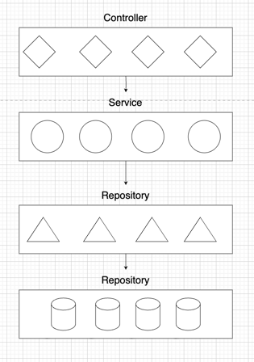

# PowerFind

PowerFind is a demo backend project
(not a real product) created to demonstrate my Java developer skills.
It simulates powerbank charging backend system.

## About project

I use a layered Spring Boot architecture including controller, service, repository, and model layers connected to a
PostgresSQL database, as illustrated in the image. Spring Boot simplifies my development by managing configurations,
dependencies, and providing built-in support for RESTful APIs and data persistence.

## Controller

The controller layer handles HTTP requests and routes them to the appropriate service calls.
Using OpenAPI, I generate interfaces with predefined routes, then implement them in the controllers to provide logic.
The controllers receive parameters via generated external models, transform them into domain objects, and pass them to
the service layer for processing.

## Service

The service layer contains the core business logic.
It processes data and connects the controller with the repository.

## Repository

The repository layer handles all database access.
It communicates directly with PostgresSQL to store and retrieve data.

## Database

I use a PostgresSQL database to persist all system data, integrated with Spring Boot via JDBC.
For migrations, I use Liquibase and have written an additional .sql-formatted migration to insert example data into the
database.

## OpenAPI

This project includes an OpenAPI specification that defines the available API endpoints.
It covers which endpoints are available,what inputs they require, and what responses they return.

The OpenAPI spec makes the API well-documented, easy to integrate, and simple to maintain.

Here’s a visual overview of the available endpoints:

For example, here’s a more detailed view of the `/public/powerbank` GET endpoint:

